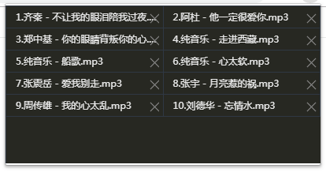
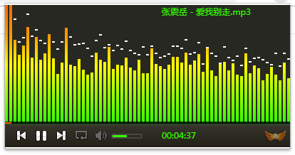
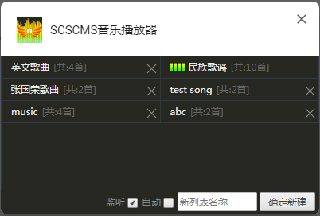

# SCSCMS音乐播放器chrome扩展程序

这是一个chrome扩展程序的音乐播放器，方便在没有安装音乐播放器时使用chrome浏览器听歌。可以建立播放列表，导入的歌曲可以存储，并支持播放远程音乐。

### 使用方法：
 - 1、打开浏览器输入地址`chrome://extensions`回车
 - 2、点击`加载已解压的扩展程序`，并选择本站的`scsMusic`文件夹（安装完成）
 - 3、在chrome浏览器右上角点击  图标，并双击添加歌曲。右键查看播放列表。
 - 4、在chrome浏览器右上角右键  选择`选项`，进入播放列表管理。

### 特别说明：

 - 因为是以开发者安装的扩展，所以每次启动浏览器都会提示`“请信用以开发者模式运行的扩展程序”`可忽略并关闭。未来着手在谷歌商店上架就不存在此问题。

 - 因数组有限，播放时间长的音乐会导致扩展程序崩溃。

### 程序图片:

首先需要添加歌曲，默认播放列表为`music`

添加好歌曲右键可查看播放列表

播放界面

选项操作界面，主要是管理播放列表。

- 点击列表名就播放本列表
- 可删除列表（暂无重命名功能）
- 监听：表示监听你打开的任意页面，判断是否能捕获到可播放的音乐
- 自动：表示打开浏览器就自动播放歌曲，慎用！

####　如有任何问题，请留Issues